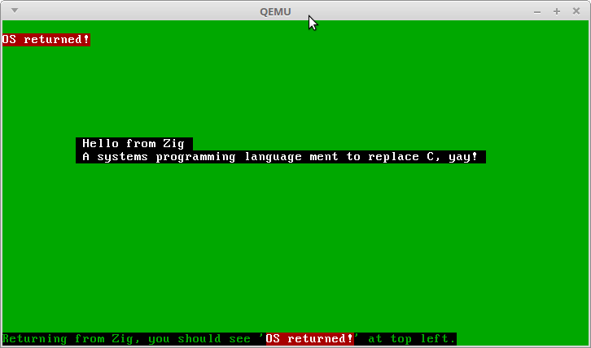

# zigtest
Various zig test programs.

See [ziglang.org](http://ziglang.org) and [zig at GitHub](https://github.com/andrewrk/zig)

## emacs
Minimal Emacs zig-mode, provides the bare minimum to ease the use of Emacs.

## securehash
An attempt to translate a sha1 implementation in C to Zig.

## fpconv
Translation of fpconv/atof from C to Zig.

See also [dtoa-benchmark](https://github.com/miloyip/dtoa-benchmark)

## stringalgo
Various string algorithms suitable to test Zig in various ways.

## json
Trying to parse JSON

## malloc
Playing with various memory allocators on Linux.

See also [liballoc](https://github.com/blanham/liballoc.git) translated to Zig.

See also [webos jemalloc](https://github.com/openwebos/jemalloc).
Original jemalloc by Jason Evans/FreeBSD.

## zigos
Mimicing the brilliant Blog OS from [Philipp Oppermann's blog](http://os.phil-opp.com/)

