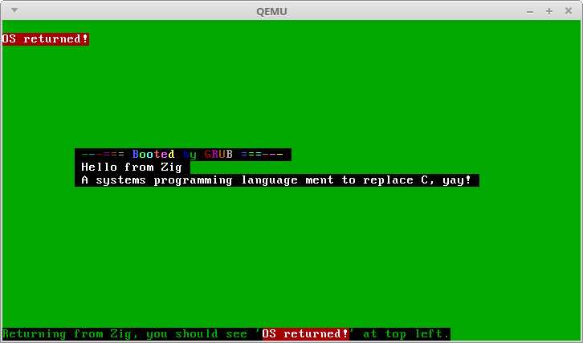

# zigos
Mimicking the brilliant Blog OS from [Philipp Oppermann's
blog](http://os.phil-opp.com/) a fair amount of well described
details can be found there.



```
shell$ make clean; make
shell$ qemu-system-x86_64 -cdrom zigos-x86_64.iso -s -S -no-reboot
shell$ gdb ./build/bin/kernel-x86_64.bin -ex "set architecture i386:x86-64 ; target remote :1234"
```

Some required packages on Linux (this on Linuz Mint 18)
```
sudo apt-get install nasm
sudo apt install xorriso
sudo apt-get install grub-pc-bin
sudo apt-get install qemu
```
